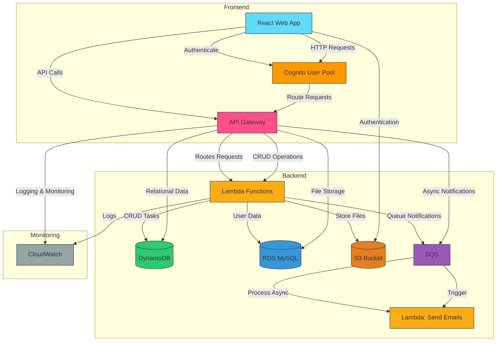

@@ -1,10 +1,92 @@
# Task Management System on AWS

[](https://aws.amazon.com)

## 📊 Architecture Diagram



## 🛠 Setup Guide

### Prerequisites
- AWS Account
- creating iam users and user groups
- AWS CLI configured (`aws configure`)
- react.jsx (for frontend)
- Python 3.8+ (for Lambda)

### Deployment Steps
1. **Clone the repository**:
   ```bash
   git clone https://github.com/yourusername/task-manager-aws.git
   cd task-manager-aws
   ```

2. **use lambda for backend**:
   ```bash
   creatug lambda functions for TASK CRUD AND USERS AND NOTIFICATIONS AND UPLOAD to be connected with frontend and connecting gatewys to it ```
3.**apply cognito auth**  

4. **Deploy frontend**:
   ```bash
   cd ../frontend
   npm install
   npm run build
   aws amplify and auth installed 
   ```

## 📖 User Manual

### Authentication
```http
sign up using frontend , the log in, navigate to taksks and create a task, sign out when done
```

### Task Operations
| Endpoint | Method | Description |
|----------|--------|-------------|
| `/tasks` | POST | Create new task |
| `/tasks` | GET | List all tasks |
| `/tasks/{id}` | GET | Get task details |

## 📝 Design Decisions

### Key Architecture Choices
1. **Serverless First** - Using Lambda for cost efficiency
2. **Multi-Database** - DynamoDB for performance + RDS for relations
3. **Cognito Auth** - Managed authentication service
4. 4 **api gateways** - connect backend to frontend

### Challenges Faced
-connecting lambda with RDS
-connecting AUTH and allowing CORS
